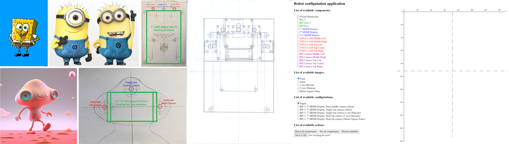

### This is a simple web application to test different design configurations of STEAM robots

The main idea for this project is to combine the hardware design of a robot with web programming skills, and it is also part of the STEAM process.

The application is written in HTML 5 and JavaScript. It is intended to work in any modern web browser. It can work completely offline (the Internet is only needed to load JavaScript dependencies), but a simple local web server like the Python module http.server is required. Note that Python on the desktop computer is only needed to run the http.server module, and any kind of such server will also work.

To run the project, clone or unzip it in some directory, run in it ```python -m http.server 8080``` and browse address: http://localhost:8080

To start using the application, it is necessary to read and understand how it works. Everything is in ```index.html```. It is based on the d3 (Data-Driven Documents) framework, written in JavaScript. In addition, a Markdown viewer written in HTML and JavaScript was added to the project for both viewing the current README.md file and for a better programming experience. Many middle-level techniques in HTML, CSS and JavaScript are needed. In addition, some skills in image processing and animation will be helpful.

The results of using the application are simulations, pictures and animations that help in the design process. One can not expect to get real design staff like PCBs, files for 2D laser catting or 3D printing. In such a design process, one will get a real sensing of how the robot components can be combined and good web programming skills as a bonus.

### Next animation was produced in the real design process of a STEAM robot and initial application development



Finally, the development and usage of the application influenced the design process with many productive ideas and reduced the time significantly. On the other hand, it helped to see more possible robot configurations and the design unification.

After uploading the project to GitHub and including it in the GitHub Pages, the application is accessible on: [Steam Robot Design Simulator](https://chradev.github.io/steam-robot-design-simulator/)

